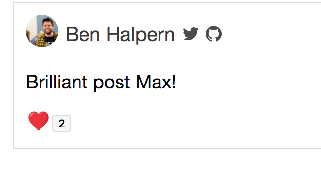
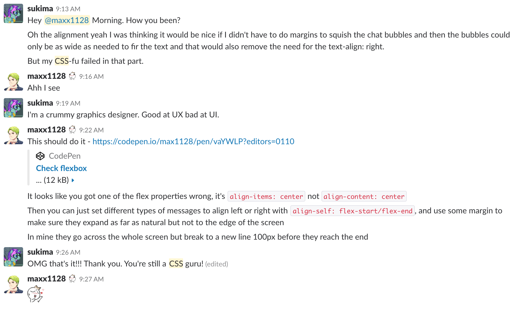
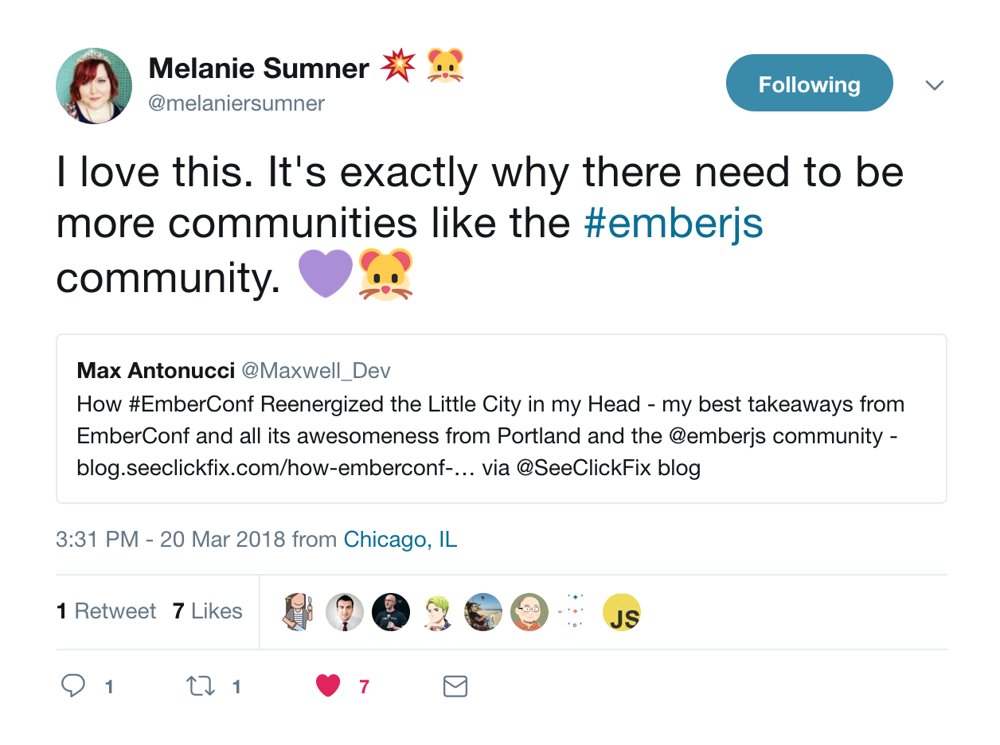

## 07-17-2018

* Turns out when I updated my site's version of Gatsby, all the CSS wasn't being included. I tried to revert it, but the issue remained. I was getting frustrated to the point where I'd get nowhere, and knew I had to walk away from the problem - eventually I'd find the answer. I put my computer at my desk and walked a dozen steps before it hit me. I needed to clear the cache in the build process! I did so, my site got the previous version of Gatsby, and it looked as it should again. Good sign I can recognize when I've reached my "point of no productivity."

## 07-16-2018

* Posted an article about the Shell introduction I wish I had, and it already got some good reception. 

## 07-13-2018

* An easier way to access the DOM for Ember Integration tests is using the QUnit-dom addon. Just install it and you'll have access right away in those tests. [QUnit-dom has many useful helpers for testing the DOM, such as visibility and classes.](https://github.com/simplabs/qunit-dom/blob/master/API.md)

## 07-12-2018

* At work I wrote two new Ember components for an app and also some integration tests. The tests made sure they could have their styles modified properly, and they could pull needed values from a (stubbed) service. I really want to increase my experience with testing, so I was glad to do this right. Next time I'll do a test-driven development approach by writing the failing tests first and then building the component, see how that affects my flow.
* In other test activities, I read a few Pragmatic Programmer chapters specifically around testing. It keeps driving home how important it is, along with going into the types of testing. The clearest tip: `It ain't code until the tests are run. 'Nuff said.`
* Some big points from the `Refactor Your Wetware` chapters on learning:
  * Learning through experiments and experience is better than rote reading and memorization
  * Know to "get a feel" for a tool. Learn enough to start, play around, make some mistakes, have some questions ready, answer them in the docs, and try to make something useful
  * Also learn by teaching. It forces you to flesh out the details, find the essence of what to learn, and explain it in your own language

## 07-11-2018

* Added some notes to [Ember components](./../JavaScript/Ember/Components.md#component-extending) on how to extend them, keeping functionality drier.
* You can open Visual Studio Code from the command line! [Set it up here.](https://code.visualstudio.com/docs/setup/mac) But if there's common files and folders you keep opening and editing, this makes accessing them real easy.
* Added initial notes on [aliases in the shell.](./../Programming/bash.md#managing-aliases) The first examples are shortcuts to manage the aliases themselves, for some meta productivity.
* I haven't emphasized the small wins enough. Hence I started this file to keep a record of my small wins and a visual marker of how much progress I'm making. Visual feedback is a great motivater.

## 07-10-2018

* Starting checking out front-end testing frameworks, both integration and visual regression. Looks like TestCafe and BackstopJS are the most approachable (and free) ones to start with.
* Tested out how you can make saved commands with arguments in Bash - using a function! It can be in the aliases file, or in a separate shell file (which you can reference in alias). [Check it here](./../Programming/bash.md). I also added more general Bash notes.

## 07-08-2018

* Helped a local dev with a flexbox problem! 

## 03-20-2018

* Melanie Sumner, one of the speakers at EmberConf2018, retweeted an article I wrote about the conference! 
